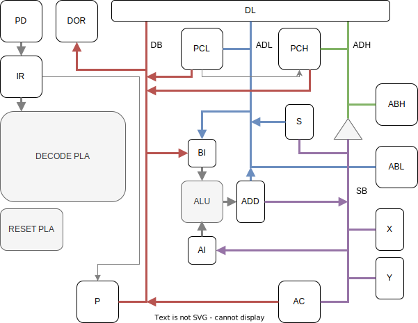

# Turtle Core 1

  

This is a homemade 8bits CPU architecture. The goal of this project is to learn how CPU work and have fun. I will base my architecture on the 6502 processor (because I will use 6502 assembly language). This way we can easily compare our results with a real 6502 and see how our perform.

## CPU Architecture

As all CPU Turtle core 1 is motsly build around differente register links with multiple 8bits BUS.

### Registers

Acronym | Name | Goal
--|--|--
DL | Data latch | This register store the data on the input bus every clock.
PCL | Program Counter Low | This register is the lowest 8 bits of the 16 bits of the program counter.
PCH | Program Counter High | This register is the highest 8 bits of the 16 bits of the program counter. 
ABL | Adress Bus Low | Hold the low 8 bits of the adress bus.
ABH | Adress Bus High | Hold the high 8 bits of the adress bus.
S | Stack pointer | The stack pointer is an 8 bit register and holds the low 8 bits of the next free location on the stack. The location of the stack is fixed and cannot be moved.
X | Register X | Can be use to store and send data. It can be used to get a copy of the stack pointer or change its value.
Y | Register Y | Can be use to store and send data.
AC | Accumulator | An 8 bit register use for all arithmetic and logical operations.
P | Processor Status | The register holds 7 flags that are update when doing operations and they can be set and clear. (Carry Flag, Zero Flag, Interrupt Disable, Decimal Mode, Break Command, Overflow Flag, Negative Flag)

### Flags
There is 7 flags that are stored in the processor status.
- Carry Flag: The carry flag is set if the last operation caused an overflow from bit 7 of the result or an underflow from bit 0. This condition is set during arithmetic, comparison and during logical shifts. It can be manually set or clear.
- Zero Flag: The zero flag is set when the result of an operation was zero.
- Interrupt Disable: This flag prevent interrupts to be trigger by external devices. It can be set or clear.
- Decimal Mode: If decimal flag is set processor will use BCD (Binary Coded Decimal) arithmetic for addition and substraction. It can be set or clear.
- Break Command: This bit is set when a BRK instruction has been executed.
- Overflow Flag: The flag is set if the result is an invalid 2's complement result. (64 + 64 = -128).
- Negative Flag: The negative flag is set if the result of the last operation had bit 7 set to a one. So the number is negative if the bit is signed. 

### Intructions
For now, this is all the instructions that are available on the CPU.
OpCode | Instruction | Cycles
-- | -- | --
$00 | BRK imp | 12
$a0 | LDY # | 5
$a5 | LDA zpg | 6
$a9 | LDA # | 5
$ad | LDA abs | 7
$bd | LDA abs,X | 8
$b9 | LDA abs,Y | 8
$8d | STA abs | 6
$ba | TSX imp | 4
$9a | TXS imp | 4
$8a | TXA imp | 4
$aa | TAX imp | 4
$98 | TYA imp | 4
$a8 | TAY imp | 4

### Memory
As the adress bus of the CPU is a 16-bits bus we can access 65537 space of 8-bits (1 byte) for a total memory of 65.537KB. The memory will be handle as follow:

Addresses | Type | Total space
-- | -- | --
$0000 - $00FF | RAM zero page | 256B
$0100 - $01FF | RAM stack | 256B
$0200 - $7EFF | RAM | 32,000B
$7F00 - $7FFF | IO | 256B
$8000 - $FFFF | ROM | 32,769B

#### Vectors
Vectors are memory adress that the CPU will load into its PC.
 - On a RESET, the CPU loads the vector from $FFFC/$FFFD into the program counter and continues fetching instructions from there.
 - On a BRK instruction, the CPU pushes the low byte and the high byte of the program counter as well as the processor status onto the stack (with bit #4 (B flag) sets), disables interrupts and loads the vector from $FFFE/$FFFF into the program counter and continues fetching instructions from there.

## Tools
### Simulation
To simulate the behavior of our architecture we use [Logisim Evolution](https://github.com/logisim-evolution/logisim-evolution).
