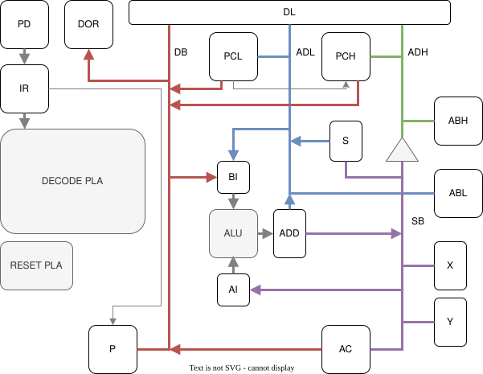

# Turtle Core 1

  

This is a homemade 8bits CPU architecture. The goal of this project is to learn how CPU work and have fun.

## CPU Architecture

As all CPU Turtle core 1 is mostly built around differents registers links with multiple 8 bits bus.

### Registers file

Acronym | Goal
--|--
RA|Register that act as accumulator. 
RB|Second entry for the ALU.
RX|General Purpose register, can be use as temporary register to store data.
RY|General Purpose register, can be use as temporary register to store data.

### Flags

There is 4 flags that are stored in the processor status.

- Carry Flag: The carry flag is set if the last operation caused an overflow from bit 7 of the result or an underflow from bit 0. This condition is set during arithmetic, comparison and during logical shifts. It can be manually set or clear.
- Zero Flag: The zero flag is set when the result of an operation was zero.
- Overflow Flag: The flag is set if the result is an invalid 2's complement result. (64 + 64 = -128).
- Negative Flag: The negative flag is set if the result of the last operation had bit 7 set to a one. So the number is negative if the bit is signed.

### Intructions

The Instruction Set Architecture (ISA) use here is a homemade RISC set that you can find [here](https://github.com/Captainfl4me/tasm).

### Memory

As the adress bus of the CPU is a 16-bits bus we can access 65537 space of 8-bits (1 byte) for a total memory of 65.537KB. The memory will be handle as follow:

Addresses | Type | Total space
-- | -- | --
$0000 - $7FFF | ROM | 32,768B
$8000 - $80FF | Program stack, store on RAM chip | 256B
$8100 - $FEFF | RAM | 32,256B
$FF00 - $FFFF | IO | 256B

### IO

#### Output pins bar

Control 16 output pins directly with a 16 bits register. Mapped as follow:

Address | Register | Description 
--|--|--
$FFFF | output_pins[0:7] | Low byte of pins bar.
$FFFE | output_pins[8:15] | High byte of pins bar.

#### Input pins bar | Interrupt

Read value of 16 input pins directly with a 16 bits register. Each individual input pins can trigger an interrupt. After an interrupt is trigger, the corresponding entry in the mask is reset to 0 and has to be manually enable again to avoid infinite interrupt triggering. Mapped as follow:

Address | Register | Description 
--|--|--
$FFFD | input_pins[0:7] | Low byte of pins bar. READ_ONLY
$FFFC | input_pins[8:15] | High byte of pins bar. READ_ONLY
$FFFB | input_interrupt_mask[0:7] | Low byte of interrupt mask.
$FFFA | input_interrupt_mask[8:15] | High byte of interrupt mask.
$FFF9 | interrupt_addr_1[0:7] | Low byte of interrupt address 1.
$FFF8 | interrupt_addr_1[8:15] | High byte of interrupt mask address 1.
$FFF7 | interrupt_addr_2[0:7] | Low byte of interrupt address 2.
$FFF6 | interrupt_addr_2[8:15] | High byte of interrupt mask address 2.
$FFF5 | interrupt_addr_3[0:7] | Low byte of interrupt address 3.
$FFF4 | interrupt_addr_3[8:15] | High byte of interrupt mask address 3.
$FFF3 | interrupt_addr_4[0:7] | Low byte of interrupt address 4.
$FFF2 | interrupt_addr_4[8:15] | Low byte of interrupt address 4.
$FFF1 | interrupt_addr_5[0:7] | High byte of interrupt mask address 5.
$FFF0 | interrupt_addr_5[8:15] | High byte of interrupt mask address 5.
$FFEF | interrupt_addr_6[0:7] | Low byte of interrupt address 6.
$FFEE | interrupt_addr_6[8:15] | High byte of interrupt mask address 6.
$FFED | interrupt_addr_7[0:7] | Low byte of interrupt address 7.
$FFEB | interrupt_addr_7[8:15] | Low byte of interrupt address 7.
$FFEC | interrupt_addr_8[0:7] | High byte of interrupt mask address 8.
$FFEA | interrupt_addr_8[8:15] | High byte of interrupt mask address 8.
$FFE9 | interrupt_addr_9[0:7] | Low byte of interrupt address 9.
$FFE8 | interrupt_addr_9[8:15] | High byte of interrupt mask address 9.
$FFE7 | interrupt_addr_10[0:7] | Low byte of interrupt address 10.
$FFE6 | interrupt_addr_10[8:15] | High byte of interrupt mask address 10.
$FFE5 | interrupt_addr_11[0:7] | Low byte of interrupt address 11.
$FFE4 | interrupt_addr_11[8:15] | High byte of interrupt mask address 11.
$FFE3 | interrupt_addr_12[0:7] | Low byte of interrupt address 12.
$FFE2 | interrupt_addr_12[8:15] | Low byte of interrupt address 12.
$FFE1 | interrupt_addr_13[0:7] | High byte of interrupt mask address 13.
$FFE0 | interrupt_addr_13[8:15] | High byte of interrupt mask address 13.
$FFDF | interrupt_addr_14[0:7] | High byte of interrupt mask address 14.
$FFDE | interrupt_addr_14[8:15] | High byte of interrupt mask address 14.
$FFDD | interrupt_addr_15[0:7] | High byte of interrupt mask address 15.
$FFDC | interrupt_addr_15[8:15] | High byte of interrupt mask address 15.
$FFDB | interrupt_addr_16[0:7] | High byte of interrupt mask address 16.
$FFDA | interrupt_addr_16[8:15] | High byte of interrupt mask address 16.

#### AXI 0

AXI4 master controller for the core. Mapped as follow:

Address | Register | Description 
--|--|--
$FFD9 | control_register[0:7] | Control AXI controller. More details can be found below.
$FFD8 | write_addr[0:7] | Low byte of address to be write in the address FIFO. Should be written first. WRITE_ONLY
$FFD7 | write_addr[8:15] | High byte of address to be write in the address FIFO. Should be written last as it triggers a FIFO push. WRITE_ONLY
$FFD6 | write_data[0:7] | Send new byte to TX fifo (16-byte). Should be written after address is fully push to FIFO. WRITE_ONLY
$FFD5 | read_addr[0:7] | Low byte of address to be write in the address FIFO. Should be written first. WRITE_ONLY
$FFD4 | read_addr[8:15] | High byte of address to be write in the address FIFO. Should be written last as it triggers a FIFO push. WRITE_ONLY
$FFD3 | read_data[0:7] | Read new byte from RX fifo (16-byte). Should be read after address is fully push to FIFO. READ_ONLY

Bit | Description
--|--
0 | TXNFULL (TX Near Full): One byte can be store in the FIFO.
1 | RXNFULL (RX Near Full): One byte can be store in the FIFO.
2 | RXEMPTY: RX FIFO is empty.
3 | RXERROR: Last RX packet was not read because of an error.
4 | Reserved
5 | Reserved
6 | Reserved
7 | Reserved

## Tools

This project was develop under Vivado Suite to be load on a Basys3 FPGA board. Find the CPU only RTL project under `/turtlecore` folder and the package IP into `/ip_core`. To use the CPU under the full environnement and test it on real hardware you can use `/hw_testbench`.
